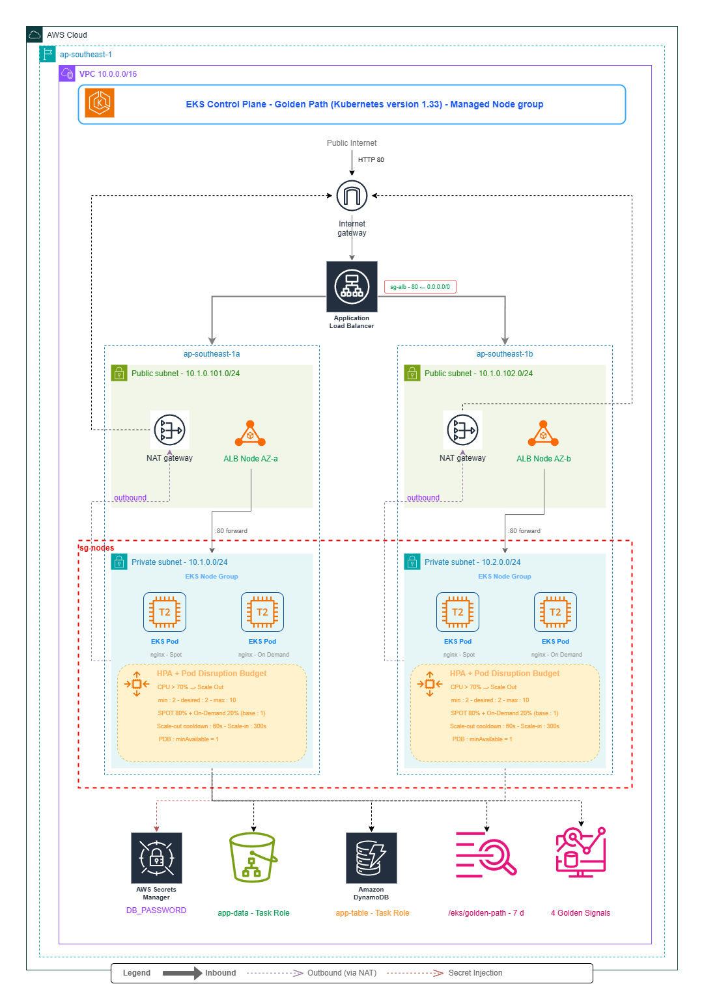

# 🛤️ Golden Path — EKS Platform on AWS

> **Practical Test Submission** — Platform Engineer (AWS)


## Architecture Overview



## Repository Structure

```
.
├── .github/
│   └── workflows/
│       ├── deploy.yml          # CI/CD: Plan → Apply → Helm deploy
│       └── destroy.yml         # Cost-saver: Tear everything down safely
│
├── terraform/
│   ├── bootstrap/
│   │   ├── main.tf             # S3 + DynamoDB for remote state (run once)
│   │   └── github-oidc.tf      # GitHub Actions IAM role (OIDC, no static keys)
│   ├── modules/
│   │   ├── vpc/                # VPC, subnets, NAT GWs, route tables
│   │   ├── eks/                # EKS control plane, Spot + On-Demand node groups
│   │   └── irsa/               # IAM Roles for Service Accounts (app, ALB, ESO)
│   └── environments/
│       └── production/
│           ├── main.tf         # Orchestrates all modules + Helm providers
│           ├── variables.tf
│           ├── outputs.tf
│           ├── providers.tf
│           ├── backend.tf      # S3 remote state
│           └── cloudwatch-dashboard.json.tpl
│
├── helm/
│   └── golden-path/
│       ├── Chart.yaml
│       ├── values.yaml         # Defaults (image, HPA, ALB, ExternalSecret)
│       └── templates/
│           ├── _helpers.tpl
│           ├── deployment.yaml # Deployment with Spot affinity + fallback
│           └── resources.yaml  # Service, Ingress, HPA, SA, ExternalSecret, PDB
│
└── README.md
```

---


## How to Run

### Step 1 — Bootstrap (run once)

This creates the S3 bucket and DynamoDB table for Terraform remote state, and the GitHub Actions IAM role.

```bash
cd terraform/bootstrap

# Use temporary credentials or your personal AWS credentials here
aws configure

terraform init
terraform apply

# Note the outputs:
# github_actions_role_arn
# s3_bucket_name
```

### Step 2 — Configure GitHub Secrets & Variables

In your GitHub repository (`Settings → Secrets and variables → Actions`):

**Secrets:**
| Name | Value |
|------|-------|
| `AWS_ROLE_ARN` | Output from bootstrap: `github_actions_role_arn` |
| `DB_PASSWORD` | A strong password for the demo DB secret |

**Variables:**
| Name | Value |
|------|-------|
| `AWS_REGION` | `` |
| `AWS_ACCOUNT_ID` | `` |

### Step 3 — Deploy via GitHub Actions

Push to `main` — the deploy workflow runs automatically:

1. **Terraform Plan** — shows what will be created
2. **Terraform Apply** — provisions VPC, EKS, IAM, Secrets Manager, etc.
3. **Helm Deploy** — deploys nginx with ALB, HPA, ExternalSecret

Or trigger manually:
```
GitHub → Actions → "Deploy — Infrastructure & App" → Run workflow
```

### Step 4 — Access the Application

After the workflow succeeds, get the ALB hostname:

```bash
aws eks update-kubeconfig --region ap-southeast-1 --name golden-path-production

kubectl get ingress -n golden-path
# NAME                  CLASS   HOSTS   ADDRESS                              PORTS
# golden-path-golden-path   alb   *       k8s-goldenpath-xxx.ap-southeast-1.elb.amazonaws.com   80
```

Visit `http://<ADDRESS>` in your browser — you'll see the nginx welcome page.

### Step 5 — Destroy (cost-saver)

When you're done testing, tear everything down:

```
GitHub → Actions → "Destroy — Tear Down All Resources" → Run workflow
```

Type `DESTROY` in the confirmation field. The workflow will:
1. Uninstall the Helm release (removes ALB)
2. Run `terraform destroy`

> **Note:** The Terraform state S3 bucket is preserved. Delete it manually if desired.

---

## Key Design Decisions

### EKS (Managed Node Groups) vs ECS Fargate

| Factor | EKS | ECS Fargate |
|--------|-------------|-------------|
| **Kubernetes ecosystem** | Full — HPA, RBAC, Helm, ExternalSecrets, custom controllers | Limited — no standard K8s tooling |
| **Portability** | Workloads portable to any K8s cluster | AWS-locked |
| **Control** | Fine-grained scheduling, affinity, taints | Abstracted away |
| **Cost at scale** | Spot nodes = 60-90% savings | Per-task pricing, no Spot equivalent |
| **Complexity** | Higher operational overhead | Simpler to start |
| **GitOps readiness** | Argo CD, Flux, Helm-native | Limited |

**Decision:** EKS with managed node groups was chosen because this is a "Golden Path" for a microservices platform — developers will expect standard Kubernetes primitives, Helm charts, and ecosystem tools (ESO, ALB controller, HPA). The platform team owns the node groups; developers get a clean namespace and a Helm chart.

Fargate would be preferable for a smaller team that wants zero node management and is comfortable with ECS task definitions rather than Kubernetes manifests.

### Spot + On-Demand Fallback Strategy

- **Spot node group** (primary): 3 diverse instance types (`t3.medium`, `t3a.medium`, `t2.medium`) maximise Spot pool availability. Scales 0–10 nodes.
- **On-Demand node group** (fallback): Always keeps ≥1 node for critical system pods. Has a `node-type=on-demand:NoSchedule` taint.
- **App pods**: `preferredDuringSchedulingIgnoredDuringExecution` affinity prefers Spot (weight 80) but the On-Demand toleration allows fallback if Spot capacity is interrupted.
- **PodDisruptionBudget** ensures at least 1 replica survives node drains during Spot interruptions.

### Secret Management (External Secrets Operator)

```
AWS Secrets Manager ──► External Secrets Operator (IRSA) ──► Kubernetes Secret ──► Pod env var
     (source of truth)           (sync engine)                  (auto-refreshed 1h)
```

No secret values ever appear in Helm values, Git, or environment variables. The ESO pod uses IRSA (OIDC-federated IAM role) to call Secrets Manager — no static AWS credentials anywhere.

### IRSA (IAM Roles for Service Accounts)

Three distinct IAM roles are created via OIDC federation:
1. **App role** — S3 read/write on `golden-path-app-data-*`
2. **ALB Controller role** — EC2/ELB permissions to manage load balancers
3. **External Secrets role** — SecretsManager read on `golden-path/*`

Each role's trust policy is scoped to a specific Kubernetes namespace + service account, following least-privilege.

### CloudWatch Dashboard — 4 Golden Signals

The dashboard at `CloudWatch → Dashboards → golden-path-production-golden-signals` tracks:

| Signal | Metric Source |
|--------|--------------|
| **Latency** | ALB `TargetResponseTime` (p50/p95/p99) |
| **Traffic** | ALB `RequestCount` + Container Insights pod count |
| **Errors** | ALB `HTTPCode_Target_4XX_Count` + `5XX_Count` + container restarts |
| **Saturation** | Container Insights `pod_cpu_utilization`, `pod_memory_utilization`, `node_cpu_utilization` |

An annotation on the CPU saturation graph marks the HPA threshold (70%) so the team can immediately see when scaling events will be triggered.

---

## Local Development / Manual Terraform

```bash
cd terraform/environments/production

# Authenticate
aws sso login  # or: export AWS_PROFILE=your-profile

terraform init
terraform plan -var="db_password=my-test-password"
terraform apply -var="db_password=my-test-password"

# Update kubeconfig
aws eks update-kubeconfig --region ap-southeast-1 --name golden-path-production

# Deploy the app manually
helm upgrade --install golden-path ./helm/golden-path \
  --namespace golden-path --create-namespace \
  --set "serviceAccount.annotations.eks\.amazonaws\.com/role-arn=$(terraform output -raw app_irsa_role_arn)"
```

---

> Use the **Destroy workflow** to reduce cost to ~$0 between tests. The NAT GW is the biggest cost; reduce to 1 AZ in dev to save ~$67.
